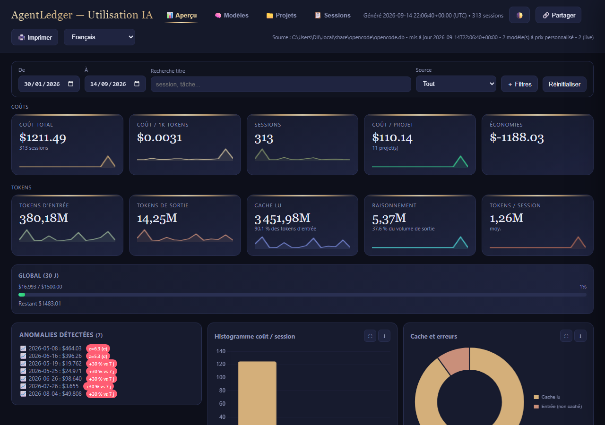

# AgentLedger — offline AI agent cost ledger




**AgentLedger** tracks AI agent usage and cost locally — no cloud, no account,
no network calls. It reads agent databases **read-only** and builds a single
offline HTML dashboard with tabs, charts, budgets and CSV/JSON exports.

Supported sources (additive merge, dedup key `(source, source_session_id)`):

| Source | Connector | Data |
|---|---|---|
| OpenCode | `extract.py` | `opencode.db` (SQLite): sessions, tokens, cost |
| Kilo / KiloCode | `extract_kilo.py` | `kilo.db` (SQLite): sessions, messages, parts |
| AutoClaw / OpenClaw | `extract_autoclaw.py` | `telemetry/` journal + snapshots (read-only) |
| WorkBuddy | `extract_workbuddy.py` | `workbuddy.db` (SQLite): sessions + plan credits |

> WorkBuddy bills in **plan credits, not USD** — imported as-is with
> `cost_source="workbuddy"`. See [`Docs/WorkBuddy.md`](Docs/WorkBuddy.md).

## Requirements

- Python 3.10+ (**stdlib only, no `pip install`**)
- At least one agent with recorded sessions

Default database locations:

- Windows: `%USERPROFILE%\.local\share\opencode\opencode.db`
- macOS/Linux: `~/.local/share/opencode/opencode.db`

## Documentation

- Overview and commands: `Docs/README.md`
- Dashboard structure: `Docs/dashboard.md`
- Target architecture: `Docs/architecture.md`
- Roadmap: `Docs/plan.md`
- Connectors: `Docs/AutCLW.md`, `Docs/WorkBuddy.md`
- Changelog: `CHANGELOG.md`

## Quick start

```powershell
python extract.py            # 1. extract sessions (incremental)
python build_report.py       # 2. build dist/report.html
start dist\report.html       # 3. open the report (offline)
```

Or all-in-one (all sources, then report):

```powershell
python launcher.py --no-open --full
```

## Standalone executable

Build the one-file Windows executable:

```powershell
python build_exe.py --confirm
.\dist\AgentLedger.exe
```

The launcher extracts every available source, merges them, builds the report
and opens it in the browser. Flags include `--db`, `--full`, `--since`,
`--watch`, `--reset`, `--open-only`, `--no-open`, `--no-strict`, `--diagnose`,
`--version`, plus per-source `--kilo-db`, `--no-kilo`, `--autoclaw-dir`,
`--no-autoclaw`, `--workbuddy-db`, `--no-workbuddy`.
Frozen-app data and user config live under `%LOCALAPPDATA%\AgentLedger`
(override with `AGENTLEDGER_USER_DIR`); source databases stay read-only.

> Migrating from OpenCost? Rename `%LOCALAPPDATA%\OpenCost` to
> `%LOCALAPPDATA%\AgentLedger` to keep dataset, watermarks and config
> (`OPENCOST_USER_DIR` is still honored as a fallback).

If `make` is available: `make report`, `make open`, `make open-app`, `make exe`, `make exe-debug`.

## `extract.py` commands

| Command | Effect |
|---|---|
| `python extract.py` | incremental extraction (delta since last sync) |
| `python extract.py --full` | full re-extraction (after editing `config/pricing.json`) |
| `python extract.py --db <path>` | custom OpenCode database |
| `python extract.py --watch` | watch `opencode.db` (watchdog if available, else poll) and re-extract |
| `python extract.py --watch --build` | same + regenerate `dist/report.html` |

Environment variable: `OPENCODE_DB` (path to the database).

## Per-model cost overrides

Edit `config/pricing.json` — prices per **1 million tokens (USD)**;
the key is `providerID/modelID`:

```json
{
  "models": {
    "opencode/big-pickle": {
      "input_per_1M": 2.5,
      "output_per_1M": 10.0,
      "cache_read_per_1M": 1.0,
      "cache_write_per_1M": 2.5
    }
  }
}
```

- A model **missing** from the list keeps the cost **computed by its agent**.
- After editing: `python extract.py --full ; python build_report.py`.
- In the report, the cost panel is **live**: typing recalculates KPIs/charts/table instantly, saves a `localStorage` draft, and `Export pricing.json` downloads the file (replace `config/pricing.json` then `--full` to persist). 🌓 light/dark theme.
- `python build_report.py --external`: external `dataset.json` (fetch) for large volumes (>10k sessions) instead of inline.

## The report (`dist/report.html`)

- Tabs: Overview / Models / Projects / Sessions (deep-linkable via `?view=`)
- KPIs: total cost, input/output tokens, cache, cost/1k tokens, sessions
- Charts: cost & tokens/day by model, cost donut by model, cost by agent,
  cost/session histogram, cache ratio
- Filters: sticky compact bar (dates, title search, source) + expandable panel
  (multi-model, agent, project, team, min/max cost)
- Sortable detail table (100/page, `aria-live`) + live CSV/JSON export,
  click a row for the session detail drawer
- Zero network calls on load (except `--external`): Chart.js and data inlined
- `make test`: `py_compile` + `unittest` (95 tests); GitHub Actions (Linux + Windows)

## Layout

```
config/pricing.json      # custom per-model costs (editable)
config/budgets.json      # monthly caps: global / per-project / per-model
data/dataset.json        # aggregated data (generated, not versioned)
data/*_sync_state.json   # incremental sync watermarks (generated)
assets/chart.umd.min.js  # Chart.js bundled at build time (offline)
resources.py             # source/frozen path resolution
extract*.py              # database/telemetry -> dataset.json
build_report.py          # dataset.json -> dist/report.html
launcher.py              # orchestration + report opening
build_exe.py             # PyInstaller build for the EXE
dist/report.html         # final single-file offline report
```

## Contributing

See [`CONTRIBUTING.md`](CONTRIBUTING.md). Bug reports and connector ideas are
welcome via GitHub issues — please include `launcher --diagnose` output and
the failing test or fixture (never paste API keys or conversation content).
